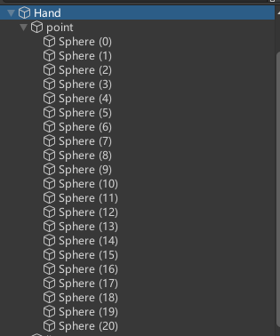
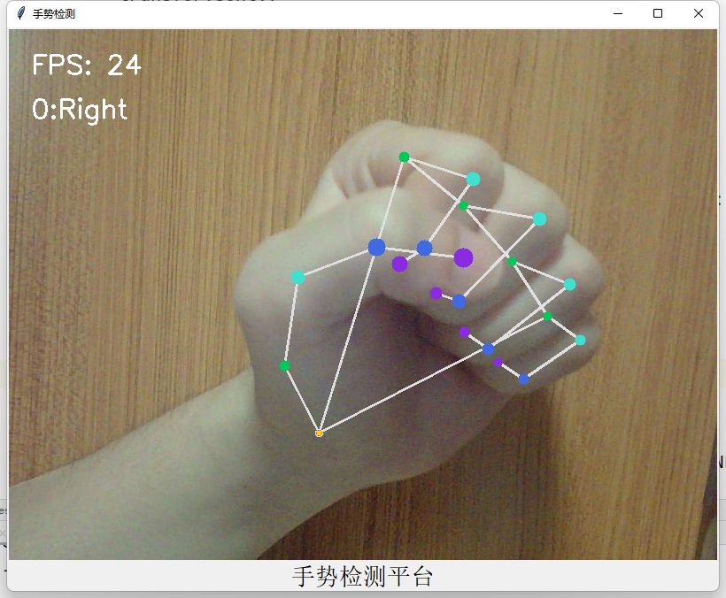
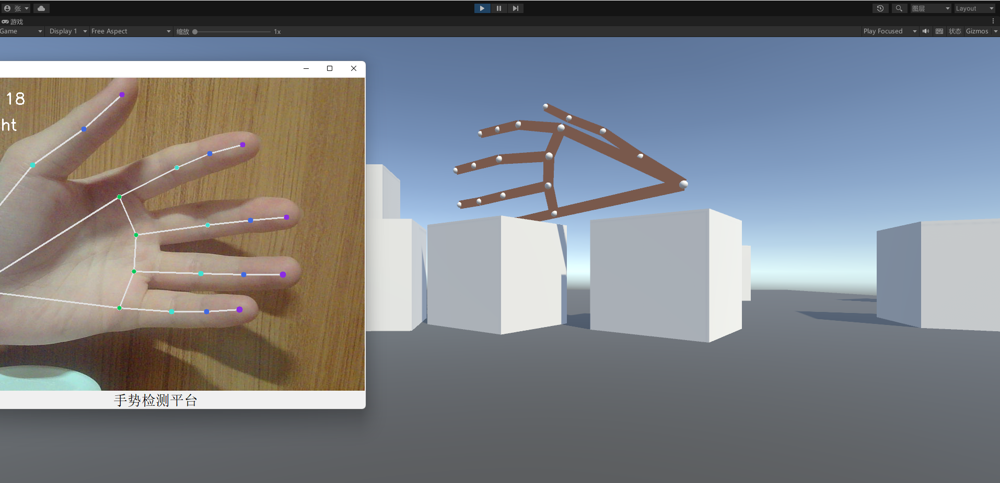

## 1. 项目简介

### 1.1 项目背景

​	手部跟踪是人机交互中最直观的交互模式之一，是混合现实终端交互的最新趋势。手部跟踪技术可以帮助用户“解放双手”，实现真正的解放双手，让用户以最直观的方式体验在增强现实和物理世界之间的融合。手部跟踪和手势识别是不同的技术，手部跟踪提供了更多的可变性，因为它跟踪手的大小、手指位置和其他特征。手部跟踪系统使用用户的手掌和手指作为输入，每根手指、整个手掌和手势的位置和旋转数据均可用。手部跟踪器模型输出一个额外的标量，以获取一只手在输入裁剪中存在并合理对齐的置信度。然而，手部跟踪也是一个具有挑战性的计算机视觉任务，因为手部经常遮挡自己或彼此（例如手指/手掌遮挡和握手），并且缺乏高对比度的模式。为了实现实时和准确的手部跟踪，需要使用先进的机器学习和深度学习算法来从图像或视频中检测和定位手部的关键点。

### 1.2 项目介绍

本项目是一个基于OpenCV和Mediapipe的手部跟踪与Unity手部模型实例化系统。它利用了OpenCV和Mediapipe的图像处理和机器学习算法，实现了对用户手部的实时跟踪和识别。它可以获取用户手部的21个关节坐标，并通过Socket通信，基于本地UDP传输，在Python和Unity之间进行数据传输。在Unity中，它利用传输的手部节点坐标，实例化了一个3D的手部模型，并根据用户的手部信息来控制场景中的物体。用户可以通过自己的手势来与虚拟现实中的环境进行交互，体验不同的游戏和娱乐场景。

### 1.3 项目依赖

项目需要安装以下库：

- `cv2`：用于图像处理，如水平镜像、颜色转换、绘制标记等。
- `tkinter`：用于创建图形用户界面，显示摄像头捕捉的图像和手部追踪的结果。
- `mediapipe`：用于检测和识别手势，利用了它提供的21个手部关键点和骨架连线。
- `socket`：用于实现数据传输，将手部关键点的坐标发送到unity端。

### 1.4 项目结构

项目主要包含以下七个文件：

- `call_camera.py`：摄像头模块，负责调用摄像头并将图像传递给图像处理模块。

- `process_frame.py`：图像处理模块，负责对图像进行手势检测和可视化，并将手部关键点的坐标传递给数据传输模块。

- `data_transmission.py`：数据传输模块，负责将手部关键点的坐标发送到本地服务器。

- `main.py`：主程序，负责运行摄像头模块。

- `ReceiveByUDP.cs`：服务器端模块，负责接收客户端发送的数据，并打印在控制台上。

- `HandTracking.cs`：手部追踪的脚本，负责在场景中显示手部关键点的位置。

- `SetLine.cs`：绘制线条的脚本，负责在场景中绘制一条从原点到目标点的线条。

- `Tracking.unitypackage`：对于Unity端的手部实例化模型封装后的资源包。

  

## 2. 详细设计和关键技术

### 2.1 类结构设计

#### Transfer：

```python
import socket
class Transfer:
    def __init__(self,data):
        self.data=data
        self.sock = socket.socket(socket.AF_INET, socket.SOCK_DGRAM)  # todo 使用UDP
        self.serverAddressPort = ('127.0.0.1', 9090)
    def sent(self):
        self.sock.sendto(str.encode(str(self.data)), self.serverAddressPort)
```

- `Transfer`：它是一个用于数据传输的类。它可以将任意类型的数据转换为字符串，并通过UDP协议发送到指定的服务器。
- `__init__`：接受一个参数data，表示要传输的数据，并将其赋值给**`self.data`，表示这个类的一个属性。
- `self.sock`：它是一个socket对象，用于创建一个UDP协议的套接字。这个套接字可以在不建立连接的情况下，向任意目标发送数据包。这个属性在类的构造方法中初始化，也可以在类的其他方法中使用，或者在类的外部关闭。
- `self.serverAddressPort`：它是一个元组，表示服务器的IP地址和端口号。
- `sent`：它的功能是将**`self.data`编码为字符串，并通过`self.sock`发送到`self.serverAddressPort`指定的服务器。

#### Process：

```python
import cv2
import mediapipe as mp
import time
import data_transmission as dt
mp_hands = mp.solutions.hands
hands = mp_hands.Hands(static_image_mode=False,
                       max_num_hands=2,
                       min_detection_confidence=0.7,
                       min_tracking_confidence=0.5)
mpDraw = mp.solutions.drawing_utils
class Process:
    def __init__(self,img):
        self.hands=hands
        self.mpDraw=mpDraw
        self.img = img
        self.mylmList=[]
        self.data=[]
    def process_frame(self):
        start_time = time.time()

        # 获取图像宽高
        h, w = self.img.shape[0], self.img.shape[1]

        # 水平镜像翻转图像，使图中左右手与真实左右手对应
        # 参数 1：水平翻转，0：竖直翻转，-1：水平和竖直都翻转
        img = cv2.flip(self.img, 1)
        # BGR转RGB
        img_RGB = cv2.cvtColor(img, cv2.COLOR_BGR2RGB)

        # 将RGB图像输入模型，获取预测结果
        results = self.hands.process(img_RGB)

        #
        if results.multi_hand_landmarks:
            for hand_landmarks in results.multi_hand_landmarks:
                for id, lm in enumerate(hand_landmarks.landmark):
                    px, py, pz = int(lm.x * w), int(lm.y * h), int(lm.z * 1000)
                    self.mylmList.append([px, py, pz])

            for lm in self.mylmList:
                self.data.extend([lm[0], 720 - lm[1], lm[2]])
            transfer=dt.Transfer(self.data)
            transfer.sent()


        if results.multi_hand_landmarks:  # 如果有检测到手

            handness_str = ''
            index_finger_tip_str = ''
            for hand_idx in range(len(results.multi_hand_landmarks)):

                # 获取并输出该手的21个关键点坐标
                hand_21 = results.multi_hand_landmarks[hand_idx]
                for index, landmarks in enumerate(hand_21.landmark):
                    print(index, landmarks)


                # 可视化关键点及骨架连线
                mpDraw.draw_landmarks(img, hand_21, mp_hands.HAND_CONNECTIONS)

                # 记录左右手信息
                temp_handness = results.multi_handedness[hand_idx].classification[0].label
                handness_str += '{}:{} '.format(hand_idx, temp_handness)

                # 获取手腕根部深度坐标
                cz0 = hand_21.landmark[0].z

                for i in range(21):  # 遍历该手的21个关键点

                    # 获取3D坐标
                    cx = int(hand_21.landmark[i].x * w)
                    cy = int(hand_21.landmark[i].y * h)
                    cz = hand_21.landmark[i].z
                    depth_z = cz0 - cz

                    # 用圆的半径反映深度大小
                    radius = max(int(3.5 * (1 + depth_z * 5)), 0)

                    if i == 0:  # 手腕
                        img = cv2.circle(img, (cx, cy), radius, (0, 215, 255), -1)
                    if i in [1, 5, 9, 13, 17]:  # 指根
                        img = cv2.circle(img, (cx, cy), radius, (87, 201, 0), -1)
                    if i in [2, 6, 10, 14, 18]:  # 第一指节
                        img = cv2.circle(img, (cx, cy), radius, (208, 224, 64), -1)
                    if i in [3, 7, 11, 15, 19]:  # 第二指节
                        img = cv2.circle(img, (cx, cy), radius, (225, 105, 65), -1)
                    if i in [4, 8, 12, 16, 20]:  # 指尖
                        img = cv2.circle(img, (cx, cy), radius, (226, 43, 138), -1)

            scaler = 1
            img = cv2.putText(img, handness_str, (25 * scaler, 100 * scaler), cv2.FONT_HERSHEY_SIMPLEX, 1 * scaler,
                              (255, 255, 255), 2 * scaler)
            img = cv2.putText(img, index_finger_tip_str, (25 * scaler, 150 * scaler), cv2.FONT_HERSHEY_SIMPLEX,
                              1 * scaler, (255, 255, 255), 2 * scaler)

            # 记录该帧处理完毕的时间
            end_time = time.time()
            # 计算每秒处理图像帧数FPS
            FPS = 1 / (end_time - start_time)

            # 在图像上写FPS数值，参数依次为：图片，添加的文字，左上角坐标，字体，字体大小，颜色，字体粗细
            img = cv2.putText(img, 'FPS: ' + str(int(FPS)), (25 * scaler, 50 * scaler), cv2.FONT_HERSHEY_SIMPLEX,
                              1 * scaler, (255, 255, 255), 2 * scaler)
        return img

```

- `Process`：它是一个用于处理图像并提取手部信息的类。

- `__init__`：它接受一个参数`img`，表示要处理的图像。它初始化了5个属性：

  ​	`self.img`：表示用于处理的图像，由传入的参数`img`赋值；

  ​	`self.hands`：表示一个手部检测的模型对象；

  ​	`self.mpDraw`：表示一个用于绘制关键点和连线的对象；

  ​	`self.mylmList`：表示一个用于存储手部关键点坐标的列表；

  ​	`self.data`：表示一个用于存储手部数据的列表。

- `process_frame`：它的功能是对`self.img`进行处理，并返回处理后的图像。这个方法的具体步骤如下：

  1. 记录开始处理的时间。
  2. 获取图像的宽高。
  3. 将图像水平镜像翻转，使左右手与真实对应。
  4. 将图像从BGR转换为RGB。
  5. 将RGB图像输入`self.hands`模型，获取预测结果。
  6. 如果预测结果中有检测到手，则遍历每一只手：
     - 遍历该手的21个关键点，并打印其坐标；
     - 使用`self.mpDraw`对象绘制关键点和连线；
     - 记录该手是左手还是右手；
     - 获取该手的手腕根部深度坐标；
     - 遍历该手的21个关键点，并根据其深度坐标绘制不同大小和颜色的圆圈；
     - 将该手的21个关键点坐标添加到`self.mylmList`列表中；
     - 将该手的21个关键点坐标转换为适合Unity使用的格式，并添加到`self.data`列表中；
     - 创建一个Transfer对象，并将`self.data`作为参数传入；
     - 调用Transfer对象的`sent`方法，将`self.data`发送到指定的服务器。
  7. 在图像上写上左右手信息和食指尖信息。
  8. 记录结束处理的时间。
  9. 计算并在图像上写上FPS数值。
  10. 返回处理后的图像。

#### Camera：

```python
import tkinter as tk
import cv2
from PIL import Image, ImageTk
import process_frame as pf
class Camera():
    def __init__(self):
        self.cap = cv2.VideoCapture(0)
        self.cap.set(3, 720)
        self.cap.set(4, 720)
        self.root = tk.Tk()
        self.root.title("手势检测")
        self.label = tk.Label(self.root)
        self.label.pack()
        self.root.bind("<Escape>", lambda e: self.root.quit())
        gesture_label = tk.Label(self.root, text="手势检测平台", font=("宋体", 20))
        gesture_label.pack()

    def show_frame(self):
        _, frame = self.cap.read()
        self.process = pf.Process(frame)
        processed_frame=self.process.process_frame()
        processed_frame_rgb = cv2.cvtColor(processed_frame, cv2.COLOR_BGR2RGB)
        img = Image.fromarray(processed_frame_rgb)
        imgtk = ImageTk.PhotoImage(image=img)
        self.label.imgtk = imgtk
        self.label.configure(image=imgtk)
        self.label.after(1, self.show_frame)

    def run(self):
        self.show_frame()
        self.root.mainloop()

    def __del__(self):
        if self.cap.isOpened():
            self.cap.release()


```

- `Camera`：它是一个用于显示摄像头图像并进行手部追踪的类。
- `__init__`：它的功能是初始化一些属性和组件。它的属性和组件有：
  - `self.cap`：表示一个`cv2.VideoCapture`对象，用于打开摄像头并设置其分辨率为720x720。
  - `self.root`：表示一个`tk.Tk`对象，用于创建一个主窗口，并设置其标题为"手势检测"。
  - `self.label`：表示一个`tk.Label`对象，用于在主窗口中显示图像，并将其添加到主窗口中。
  - `self.root.bind(“<Escape>”, lambda e: self.root.quit())`：表示绑定一个键盘事件，当按下Esc键时，退出主窗口。
  - `gesture_label`，表示一个`tk.Label`对象，用于在主窗口中显示"手势检测平台"的文字，并设置其字体为宋体20号，并将其添加到主窗口中

- `show_frame`：它的功能是从摄像头中读取一帧图像，并对其进行处理和显示。这个方法的具体步骤如下：
  - 调用`self.cap.read()`方法，获取一帧图像`frame`。
  - 创建一个`Process`对象`self.process`，并将`frame`作为参数传入。
  - 调用`self.process.process_frame()`方法，对frame进行处理，并返回处理后的图像`processed_frame`。
  - 将`processed_frame`从BGR转换为RGB格式，并赋值给`processed_frame_rgb`。
  - 使用`PIL`模块中的`Image.fromarray`方法，将`processed_frame_rgb`转换为`Image`对象，并赋值给`img`。
  - 使用`PIL`模块中的`ImageTk.PhotoImage`方法，将`img`转换为`ImageTk`对象，并赋值给`imgtk`。
  - 将`self.label`的`imgtk`属性设置为`imgtk`，并将`self.label`的`image`属性设置为`imgtk`，这样就可以在`self.label`中显示`imgtk`对应的图像了。
  - 调用`self.label.after(1, self.show_frame)`方法，表示在1毫秒后再次调用`self.show_frame`方法，实现循环显示图像的效果。

- `run`：它的功能是启动图形界面并显示图像。这个方法的具体步骤如下：
  - 调用`self.show_frame()`方法，开始显示图像。
  - 调用`self.root.mainloop()`方法，进入主窗口的事件循环。

- `__del__`：它的功能是在类被销毁时释放摄像头资源。这个方法的具体步骤为：
  - 判断self.cap是否已经打开，如果是，则调用self.cap.release()方法，关闭摄像头并释放资源。

### 2.2  关键技术

#### 基于MediaPipe创建手部追踪模型

MediaPipe是一个用于构建机器学习管道的跨平台框架，可以处理视频、音频等时序数据。本项目所创建的手部追踪模型是一个利用机器学习从单帧图像中推断出21个3D手部关键点的方法。

```python
import cv2
import mediapipe as mp
import time
import data_transmission as dt
mp_hands = mp.solutions.hands
hands = mp_hands.Hands(static_image_mode=False,
                       max_num_hands=2,
                       min_detection_confidence=0.7,
                       min_tracking_confidence=0.5)
mpDraw = mp.solutions.drawing_utils
class Process:
    def __init__(self,img):...
    def process_frame(self):...
```

本项目使用了`mediapipe`库来检测和识别手势，利用了它提供的21个手部关键点和骨架连线。定义了一个`Process`类，用于封装图像处理相关的操作。

- `__init__`: 初始化方法，用于创建一个`mediapipe.solutions.hands.Hands`对象，设置手势检测相关的参数，如静态图像模式、最大检测手数、最小检测置信度、最小跟踪置信度等。同时也创建了一个`mediapipe.solutions.drawing_utils.DrawingSpec`对象，用于设置绘制手部关键点和骨架连线的颜色、粗细等。另外，也初始化了一个空列表，用于存储手部关键点的坐标。
- `process_frame`：处理帧方法，用于对输入的图像进行手势检测和可视化。首先，记录开始处理的时间，并获取图像的宽高。然后，将图像水平镜像翻转，使图中左右手与真实左右手对应，并将图像转换为RGB格式。接着，将RGB图像输入模型的`process`方法，获取检测结果。如果检测到手，遍历每只手的21个关键点，并将其坐标添加到列表中。然后，将列表中的坐标传递给数据传输模块的`Transfer`类的`sent`方法，将其发送到本地服务器。接下来，使用`mediapipe.solutions.drawing_utils.draw_landmarks`方法，在图像上绘制手部关键点和骨架连线，并使用不同颜色和大小的圆圈反映深度大小。最后，在图像上写上左右手信息、食指指尖信息和FPS数值，并返回处理后的图像。


#### 基于Socket编程实现UDP本地通信

利用Mediapipe这个库做到可以识别手部，并得到手部21个关键点的x、y、z坐标。得到坐标后，这些坐标通过UDP本地通信作为数据发送给unity端。

```python
import mediapipe as mp
import socket
class Transfer:
    def __init__(self,data):
        self.data=data
        self.sock = socket.socket(socket.AF_INET, socket.SOCK_DGRAM)  # todo 使用UDP
        self.serverAddressPort = ('127.0.0.1', 9090)
    def sent(self):
        self.sock.sendto(str.encode(str(self.data)), self.serverAddressPort)
mp_hands = mp.solutions.hands
hands = mp_hands.Hands(static_image_mode=False,
                       max_num_hands=2,
                       min_detection_confidence=0.7,
                       min_tracking_confidence=0.5)
mpDraw = mp.solutions.drawing_utils
class Process:
    def __init__(self,img):
        self.hands=hands
        self.mpDraw=mpDraw
        self.img = img
        self.mylmList=[]
        self.data=[]
    def process_frame(self):
        start_time = time.time()
        h, w = self.img.shape[0], self.img.shape[1]
        img = cv2.flip(self.img, 1)
        img_RGB = cv2.cvtColor(img, cv2.COLOR_BGR2RGB)
        results = self.hands.process(img_RGB)
        if results.multi_hand_landmarks:
            for hand_landmarks in results.multi_hand_landmarks:
                for id, lm in enumerate(hand_landmarks.landmark):
                    px, py, pz = int(lm.x * w), int(lm.y * h), int(lm.z * 1000)
                    self.mylmList.append([px, py, pz])
            for lm in self.mylmList:
                self.data.extend([lm[0], 720 - lm[1], lm[2]])
            transfer=dt.Transfer(self.data)
            transfer.sent()
```

本项目使用了`socket`库来实现数据传输，将手部关键点的坐标发送到本地服务器。定义了一个`Transfer`类，用于封装数据传输相关的操作。

- `__init__`: 初始化方法，用于创建一个`socket.socket`对象，设置使用UDP协议，并指定本地服务器的地址和端口。

- `sent`: 发送方法，用于将输入的数据转换为字符串格式，并使用`socket.socket.sendto`方法将其发送到本地服务器。

在完成对于单帧的手部追踪处理后，将RGB图像输入模型的`process`方法，获取检测结果。如果检测到手，遍历每只手的21个关键点，并将其坐标添加到列表中。然后，将列表中的坐标传递给数据传输模块的`Transfer`类的`sent`方法，将其发送到本地服务器。

#### Unity端实现接受数据以及实例化手部模型

接受并处理python端发送过来的数据，将21个关键点对应的数据同步到对应的手部关键点模型上，最后关节与关节之间用LineRenderer进行连线。

##### Unity端接收坐标数据

```c#
using System.Collections;
using System.Collections.Generic;
using UnityEngine;
using System.Threading;
using System.Net;
using System.Net.Sockets;
using System;
using System.Text;

public class ReceiveByUDP : MonoBehaviour
{
    public static ReceiveByUDP _instance;

    Thread thread;
    UdpClient client;
    public int port = 9090;
    public bool startReceiveing = true;
    public string data;


    private void Awake()
    {
        _instance = this;
    }
    private void Start()
    {
        thread = new Thread(new ThreadStart(ReceiveData));
        thread.IsBackground = true;
        thread.Start();
    }
    private void ReceiveData()
    {
        client = new UdpClient(port);
        while (startReceiveing)
        {
            try
            {
                IPEndPoint anyIP = new IPEndPoint(IPAddress.Any, 0);
                byte[] dataByte = client.Receive(ref anyIP);
                data = Encoding.UTF8.GetString(dataByte);
            }
            catch (System.Exception e)
            {

                Debug.Log(e.Message);
            }
        }
    }
}

```

使用了`System.Net.Sockets`库来实现数据传输，接收客户端发送的数据。定义了一个`ReceiveByUDP`类，用于封装数据传输相关的操作。


##### Unity端解析传输数据

由于python发送过来的是字符串类型的数据，而我们需要的是浮点类型，所需要用到Remove()、Split()等处理字符串数据的相关方法。解析好后的数据应该是[x1 y1 z1 x2 y2 z2 x3 y3 z3......]形式。

```c#
using System.Collections;
using System.Collections.Generic;
using UnityEngine;

public class HandTracking : MonoBehaviour
{
    public Transform[] points;
    public float smooth = 1.4f;
    Vector3 velocity = Vector3.zero;
    private void FixedUpdate()
    {
        string data = ReceiveByUDP._instance.data;
        if (data.Length == 0) return;
        data = data.Remove(0, 1);
        data = data.Remove(data.Length - 1, 1);
        
        string[] strs = data.Split(',');


        for (int i = 0; i < 21; i++)
        {
            float x = 5 - float.Parse(strs[i * 3]) / 100;
            float y = float.Parse(strs[i * 3 + 1]) / 100;
            float z = 0 - float.Parse(strs[i * 3 + 2]) / 30;

            //points[i].transform.localPosition = new Vector3(x, y, z);
            points[i].transform.localPosition = Vector3.SmoothDamp(points[i].transform.position, new Vector3(x, y, z), ref velocity, Time.deltaTime * smooth);
        }

    }
}
```

创建好21个关键点模型（用Sphere代替），循环遍历数据，对于x坐标，遍历的时候应该是（i \* 3），y坐标应该是（i \* 3 + 1），z坐标是（i \* 3 + 2）。从而将解析好后的数据对应地同步到关节点模型上。

创建的关键点模型如下：




##### 连线完成手部模型实例化

```cc
using System.Collections;
using System.Collections.Generic;
using UnityEngine;

public class SetLine : MonoBehaviour
{
    LineRenderer line;
    [Range(0, 1)] public float width;
    public Material lineMaterial;
    public Transform origin, destination;

    private void Start()
    {
        line = this.GetComponent<LineRenderer>();
        line.material = lineMaterial;
        line.startWidth = width;
        line.endWidth = width;
    }
    private void Update()
    {
        line.SetPosition(0, origin.localPosition);
        line.SetPosition(1, destination.localPosition);

    }
}

```

绘制线条的脚本使用了`UnityEngine`库中的`LineRenderer`组件，用于在场景中渲染一条线段。定义了一个`SetLine`类，用于封装绘制线条相关的操作。

实现关节与关节之间用`LineRenderer`进行连线，完成对于手部模型的构建。


## 3.功能展示

#### 3.1 手部追踪：

下图是项目运行的效果示例：



可以看到，项目可以成功检测到用户的手部，并将手部关键点用不同颜色的圆圈标记出来。圆圈的半径反映了深度大小，越小表示越远，越大表示越近。在窗口上方，会显示当前检测到的左右手信息和食指指尖信息。在窗口左上角，会显示当前的FPS数值。按下Esc键可以退出程序。同时，项目也可以将手部关键点的坐标发送到本地服务器。


#### 3.2 手部模型实例化：

下图是项目运行的效果示例：



可以看到，项目可以通过检测用户的手部，采集并传输手部节点坐标到Unity端。手部模型接收到坐标后，立即将节点Sphere移动到相应的位置。由此用户可以通过本项目实现人机交互，仅由摄像头，就可以体验到虚拟环境中的触碰。


## 4. 小结

### 4.1 项目优缺点

项目的优点有：

- 使用了`mediapipe`库，可以快速准确地检测和识别手势。
- 使用了`tkinter`库，可以方便地创建图形用户界面，提高用户体验。
- 使用了`socket`库，可以实现数据传输，为后续应用提供接口。
- 利用Unity实现了手部实例化，可以更加直观地体验手部追踪的功能。

项目的缺点有：

- 代码结构不够清晰，有些功能可以封装成类或函数。
- 数据传输方式不够安全，可能存在数据丢失或被篡改的风险。
- 数据传输效果不够稳定，存在数据缺失和数据失真。
- 没有考虑光照、背景、遮挡等因素对手部追踪的影响。
- Unity中所采取的模型还是较为粗糙，不够美观。
- 功能较为简陋，仅仅是对于手部追踪的一个粗浅的应用。

### 4.2 项目改进

为了改进项目，可以考虑以下几点：

- 重构代码，将各个模块分成不同的类或函数，提高代码的可读性和可维护性。
- 使用加密或校验的方式，保证数据传输的安全性和完整性。
- 使用图像增强或背景消除的方法，提高手部追踪的鲁棒性和准确性。
- 使用卡尔曼滤波等滤波器，消除数据传输中的噪声和干扰。
- 使用Blender等建模软件，优化3D模型，提高观感效果。
- 增加系统的功能，提高本项目的可用性。

